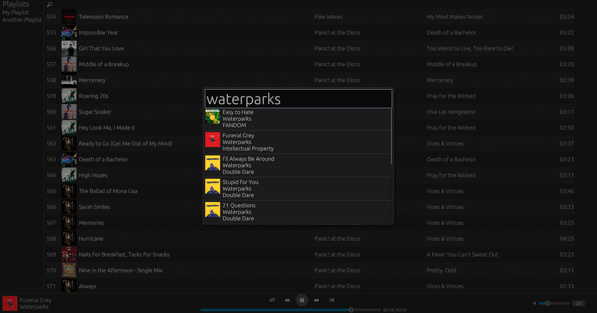

# Sanctum Player
A local music player that supports .mp3, .flac, and .m4a written in Rust

# WARNING ⚠️: Still in early development

# Features
- Search
- Album Art
- Shuffle
- Loop
- MPRIS Support (Mediakeys and Bluetooth Controls)

## TODO
- [x] MPRIS Support
- [ ] Add onboarding page
- [ ] Import songs while application is open
- [ ] Make proper queue system
- [ ] Filter songs based on tags
- [ ] Change theme

# Libraries
- [egui](https://github.com/emilk/egui) (User Interface)
- [egui_extras](https://github.com/emilk/egui/blob/main/crates/egui_extras/README.md) (egui Image Support)
- [rodio](https://github.com/RustAudio/rodio) (Audio Playback)
- [serde-json](https://github.com/serde-rs/json) (Handling config.json)
- [lofty](https://github.com/Serial-ATA/lofty-rs) (Audio Metadata)
- [image](https://github.com/image-rs/image) (Image Loading)
- [fuzzy_matcher](https://github.com/skim-rs/fuzzy-matcher) (Fuzzy Searching)
- [mpris-server](https://github.com/SeaDve/mpris-server) (MPRIS Support)
- [futures](https://github.com/rust-lang/futures-rs) (Async Handler)
